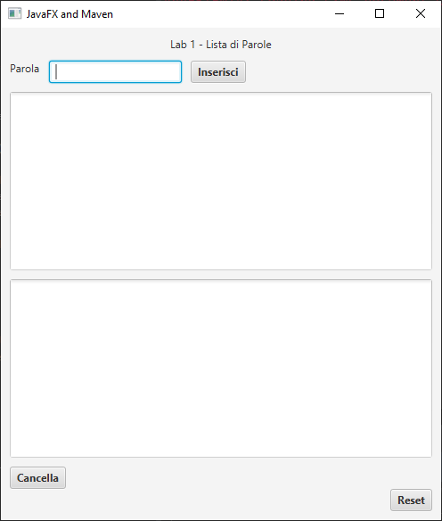
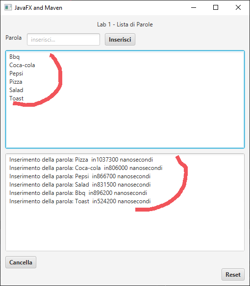
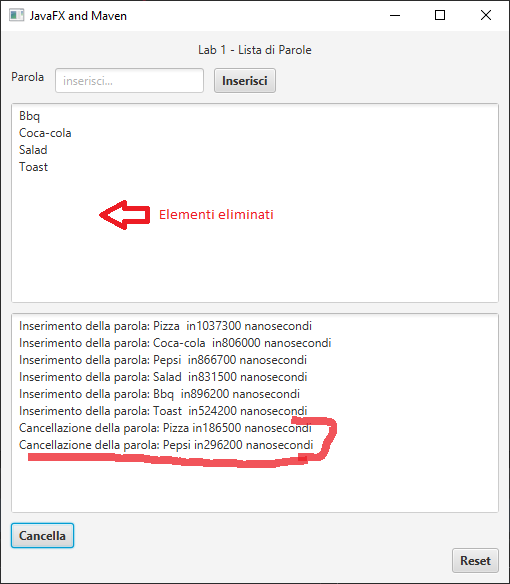
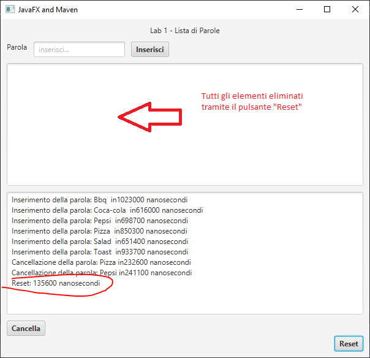

# Inserisci parole
## Sommario
* [Informazioni generali](#general-info)
* [Tecnologie](#tecnologie)
* [Screenshoot](#Screenshoot)

## Informazioni generali
Lo scopo del programma è quello di permettere all’utente di:
* Inserire delle parole in una area di testo tramite il bottone Inserisci.
* Visualizzare le parole inserite nell’area di testo sottostante in ordine alfabetico.
* Permettere la cancellazione di tutte le parole tramite il bottone Reset.
* Permettere di eliminare solamente la parola selezionata nell’area di testo tramite il bottone Cancella.
* Visualizzare i tempi di esecuzione di ciascuna operazione eseguita dal programma.
## Tecnologie
Il progetto è stato creato con:
* Java 17
* Scene Builder
## Screenshoot
#### Finestra del programma

  
  
  
#### Inserimento delle parole con il pulsante "Inserisci" e relativi tempi di esecuzione

  
  
  
#### Cancellazione delle parole tramite selezione con il mouse, pressione del pulstante "Cancella" e relativi tempi di esecuzione

  
  
  
#### Eliminazione di tutte le parole con il pulsante "Reset" e relativi tempi di esecuzione

  
  
  

